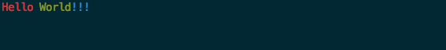
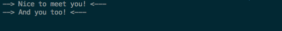
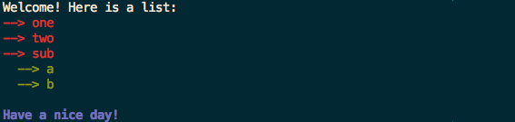

# line   &nbsp;
[](http://godoc.org/github.com/dollarshaveclub/line)
[](https://circleci.com/gh/dollarshaveclub/line/tree/master)
[](https://goreportcard.com/report/github.com/dollarshaveclub/line)

line is an easy to use package for stylizing terminal output. line focuses on usability via chaining and, consequently, is quite flexible. line also boasts compatibility with the popular [Color](https://github.com/fatih/color) package.

## Install

```bash
go get github.com/dollarshaveclub/line
```

## Usage

### Simple

```go
package main

import "github.com/dollarshaveclub/line"

func main() {
    line.Red().Print("Hello ").Green("World").Blue().Println("!!!")
}
```


### Prefix / Suffix

```go
package main

import "github.com/dollarshaveclub/line"

func main() {
	line.Prefix("--> ").Suffix(" <---").Println("Nice to meet you!").Println("And you too!")
}
```


### Complex

```go
package main

import (
	"os"

	"github.com/dollarshaveclub/line"
	"github.com/fatih/color"
)

func main() {
	output := line.New(os.Stdout, "", "", line.WhiteColor)
	output.Println("Welcome! Here is a list:")

	li := output.Prefix("--> ").Red()
	li.Println("one").Println("two").Println("sub")

	subli := li.Prefix("  --> ").Green()
	subli.Println("a").Println("b")

	output.Println()

	boldgreen := color.New(color.Bold, color.FgMagenta)
	output.Format(boldgreen).Println("Have a nice day!")
}
```
